# DIY cell culture CO₂ monitor

We built our own CO₂ monitor for our cell culture incubator. It was fun, and you can try too. Firmware 0.11.0.

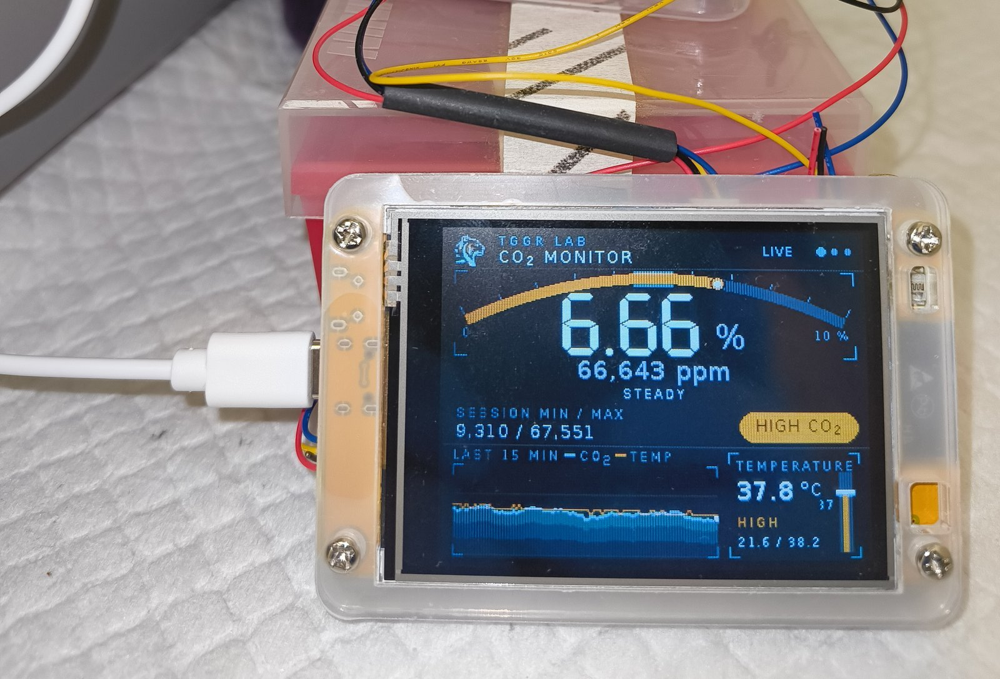

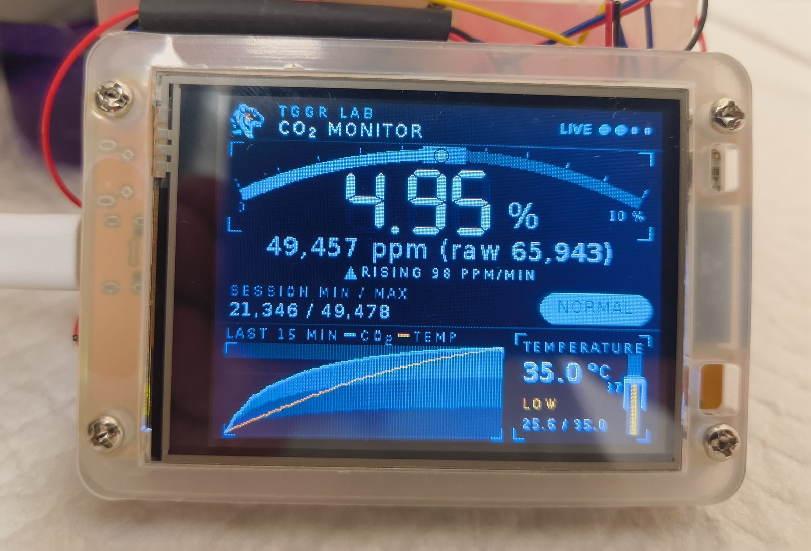

**The parts are cheap.** The whole build costs a small fraction of a commercial incubator CO₂ monitor.

**Ready-made meters will not do.** Most ready-made CO₂ meters, including those on AliExpress, stop at 5,000 ppm. An incubator runs at 50,000 ppm, so they are useless here. The MH-Z16 measures up to 100,000 ppm.

**Calibrate before you trust it.** Out of the box this sensor read about a third high inside the incubator. Compare it with a known incubator or a trusted meter first.

**Not tied to this board.** The sensor needs one input pin, so any ESP32 will do, with or without a screen. Other sensors, such as humidity, can be added.

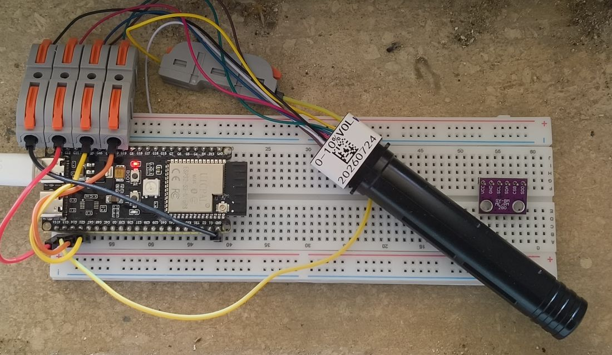

## Parts

| Part | Qty | Notes | Find it |
|---|---|---|---|
| ESP32-2432S028R display board | 1 | Usually sold with its JST pigtails | [Search AliExpress](https://www.aliexpress.com/w/wholesale-ESP32-2432S028R.html) |
| Winsen MH-Z16, 0–10 % vol | 1 | Must be the 0–10 % range | [Search AliExpress](https://www.aliexpress.com/w/wholesale-MH-Z16-CO2-sensor.html) |
| DS18B20 waterproof probe | 1 | Red, black and yellow leads | [Search AliExpress](https://www.aliexpress.com/w/wholesale-DS18B20-waterproof-probe.html) |
| DS18B20 screw-terminal adapter | 1 | Carries the pull-up resistor | [Search AliExpress](https://www.aliexpress.com/w/wholesale-DS18B20-adapter-module-terminal.html) |
| Lever connectors | 3 | One per MH-Z16 lead | [Search AliExpress](https://www.aliexpress.com/w/wholesale-lever-wire-connector-2-pin.html) |
| Acrylic case for the board | 1 |  | [Search AliExpress](https://www.aliexpress.com/w/wholesale-ESP32-2432S028R-case.html) |
| USB-C cable and 5 V supply | 1 |  | [Search AliExpress](https://www.aliexpress.com/w/wholesale-USB-C-cable.html) |
| Small box, pipette tip box | 1 each | Junction box and sensor holder |  |
| microSD card | optional | For logging | [Search AliExpress](https://www.aliexpress.com/w/wholesale-microSD-card-8GB.html) |

## Wiring map

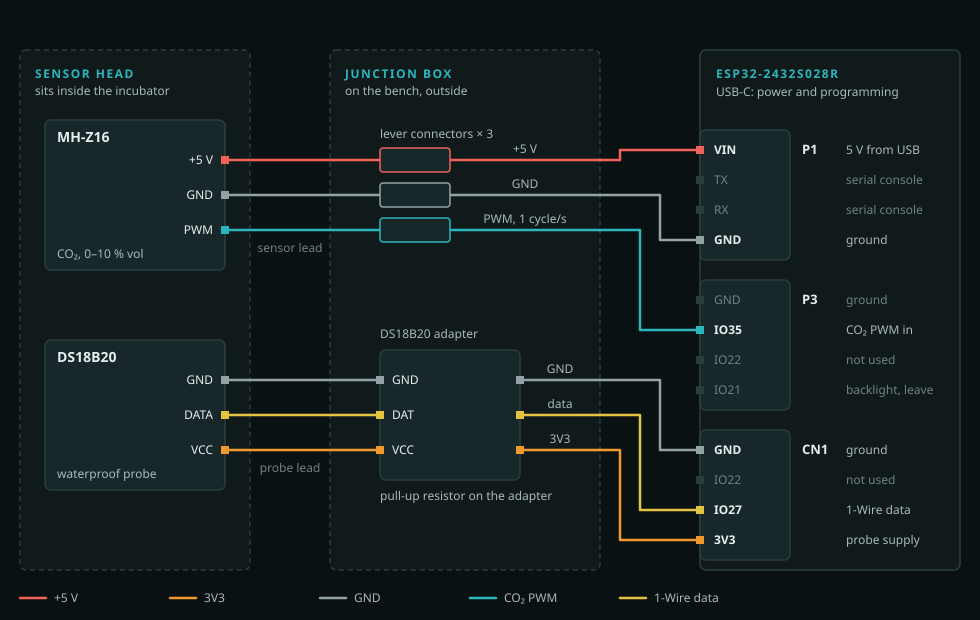

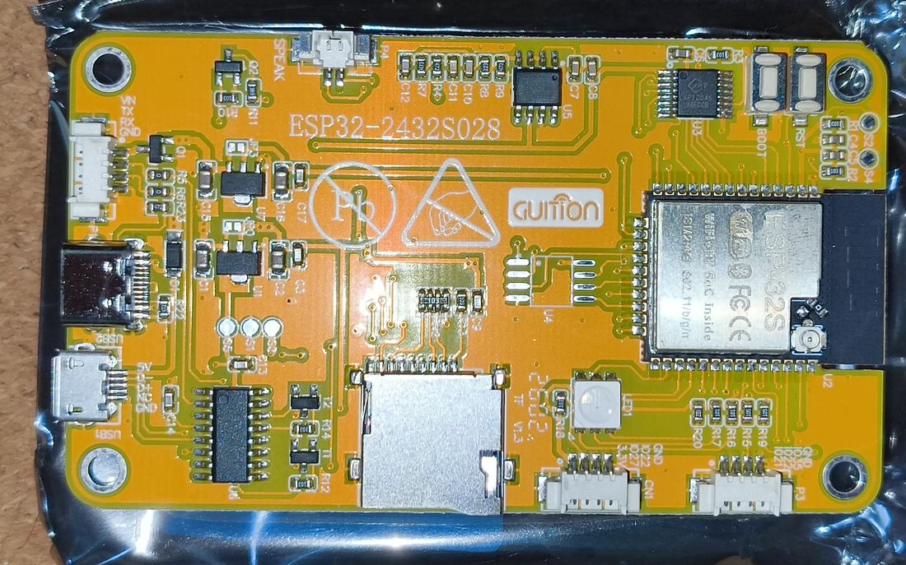

| Wire | Socket | Pin |
|---|---|---|
| MH-Z16 +5 V | P1 | `VIN` |
| MH-Z16 GND | P1 | `GND` |
| MH-Z16 PWM | P3 | `IO35` |
| DS18B20 VCC, red | CN1 | `3V3` |
| DS18B20 GND, black | CN1 | `GND` |
| DS18B20 DATA, yellow | CN1 | `IO27` |

## Build order

1. **Flash the firmware.** Do this on the bare board, before any wiring.

   ```bash
   arduino-cli lib install "LovyanGFX" "OneWire" "DallasTemperature"
   cd firmware/CO2_CYD
   ./build.sh upload
   ```

2. **Fit the pigtails.** Plug a JST pigtail into P1, P3 and CN1. Jumper pins do not grip these sockets.

   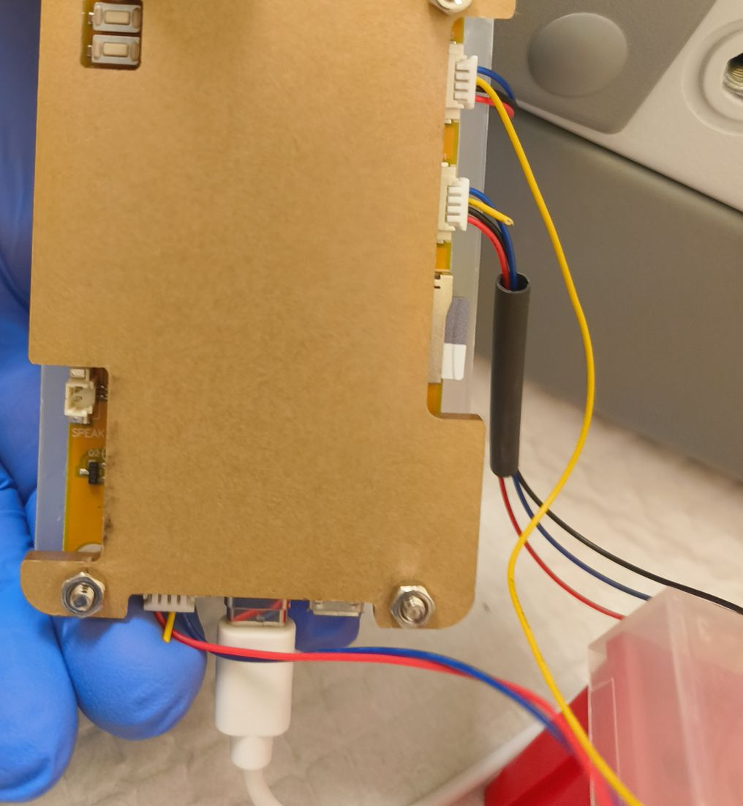

3. **Wire the MH-Z16.** Red to VIN, black to GND, yellow to IO35, through the lever connectors. Tie back the other leads.

   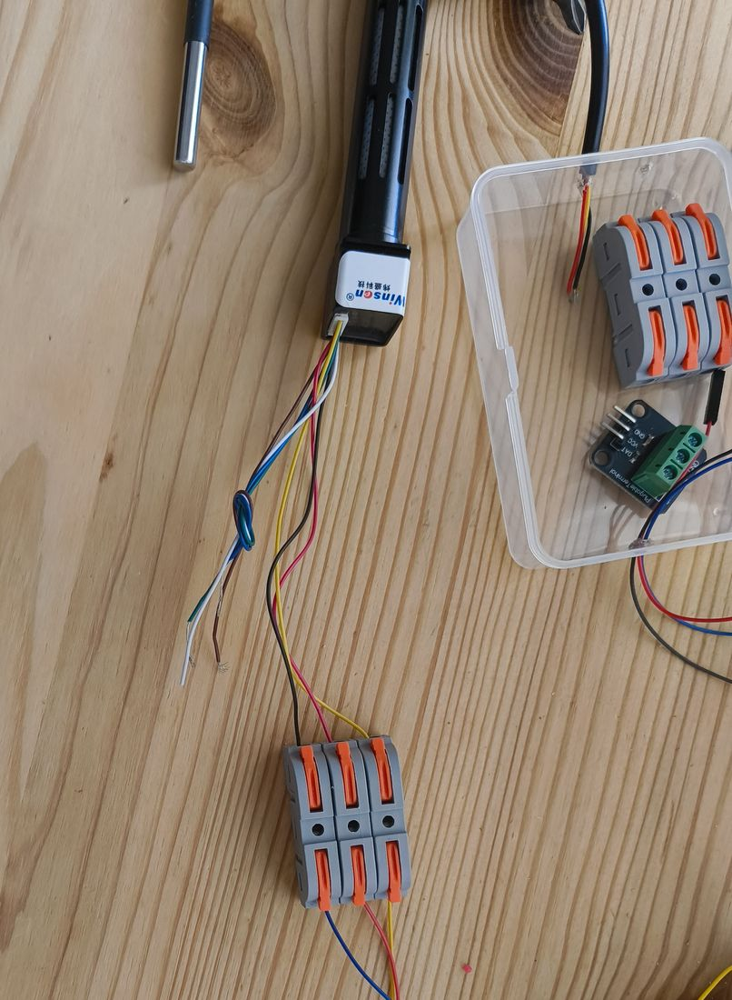

4. **Wire the DS18B20.** Clamp the probe into the adapter. Run VCC to 3V3, GND to GND, DAT to IO27.

5. **Close the junction box.** Sensor leads in one side, board wires out the other.

   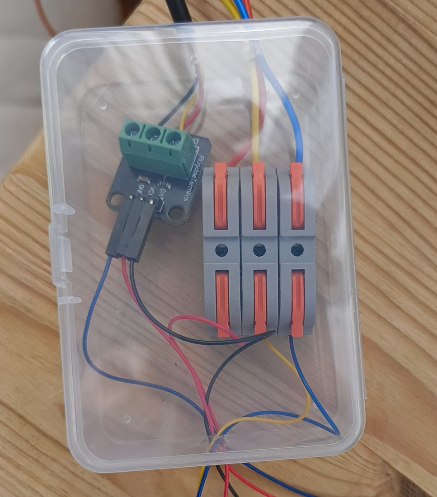

6. **Power up.** The start-up screen lists each part as it is found. Expect CO₂ SENSOR ONLINE and TEMP PROBE OK.

7. **Calibrate the touch panel.** Open the serial monitor, type c, tap the four targets.

   ```bash
   cd firmware/CO2_CYD
   ./build.sh monitor
   ```

8. **Place the sensor head.** Sensors inside the incubator, board and junction box outside.

   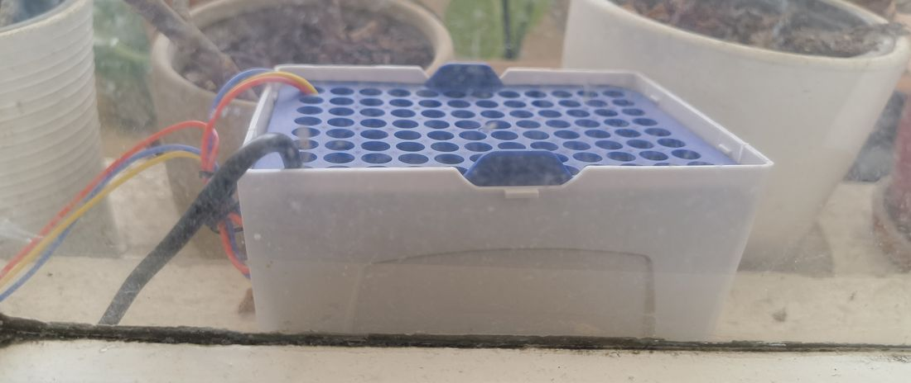

   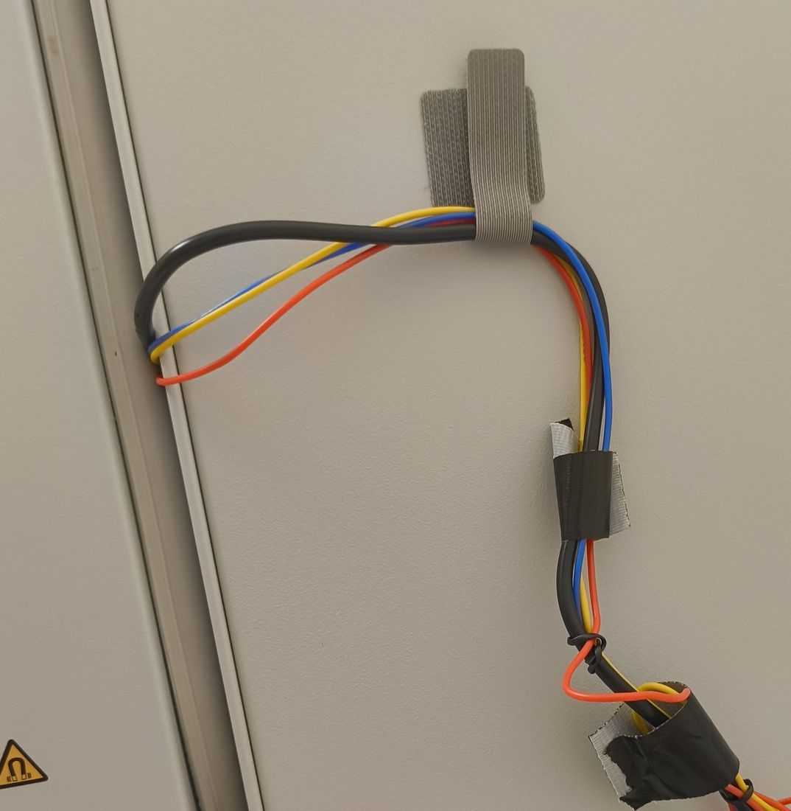

## Reading the screens

Tap anywhere to move to the next page. There are four: main, graph, diagnostics and connect.

### Main page

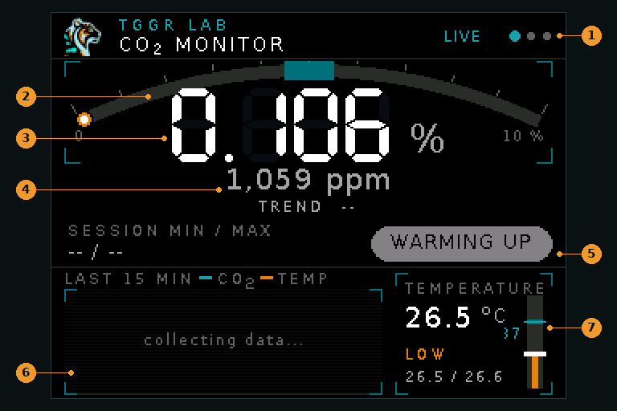

1. LIVE while readings arrive
2. Gauge, 0 to 10 %, with the target band shaded
3. CO₂ in percent
4. CO₂ in ppm, raw sensor value in brackets, then the trend
5. Status
6. Last 15 minutes: CO₂ in teal, temperature in orange
7. Temperature

### Graph page

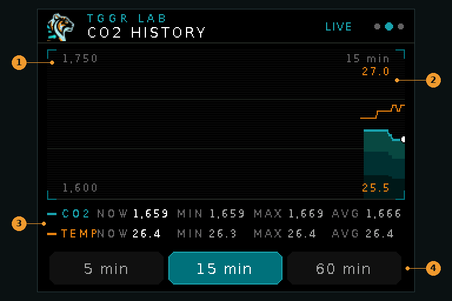

1. CO₂ axis
2. Temperature axis
3. Now, minimum, maximum and average
4. Time span

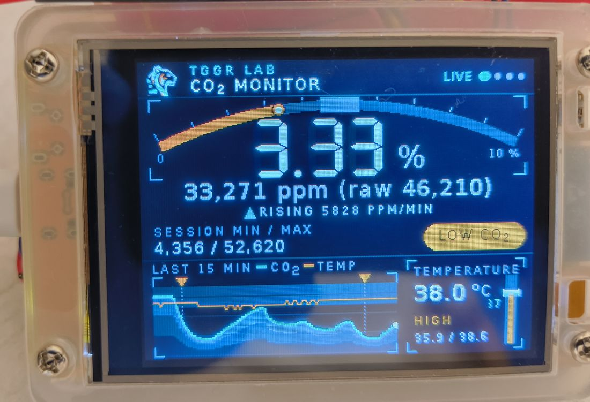

## How it measures

The sensor sends one pulse a second. The longer the pulse, the more CO₂.

    ppm = 100000 × (high − 2 ms) / (cycle − 4 ms)

### From power-on to the main page

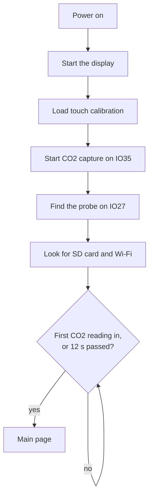
```mermaid
flowchart TD
  A["Power on"] --> B["Start the display"]
  B --> C["Load touch calibration"]
  C --> D["Start CO2 capture on IO35"]
  D --> E["Find the probe on IO27"]
  E --> F["Look for SD card and Wi-Fi"]
  F --> G{"First CO2 reading in,<br/>or 12 s passed?"}
  G -- no --> G
  G -- yes --> H["Main page"]
```

### How one reading is made

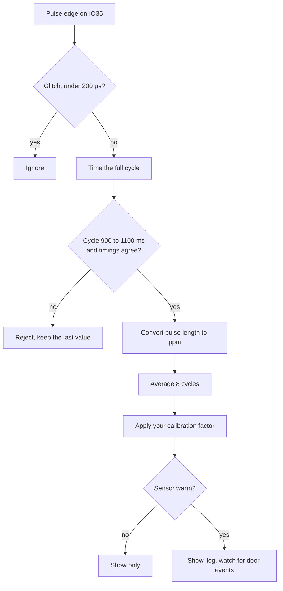
```mermaid
flowchart TD
  A["Pulse edge on IO35"] --> B{"Glitch, under 200 µs?"}
  B -- yes --> X["Ignore"]
  B -- no --> C["Time the full cycle"]
  C --> D{"Cycle 900 to 1100 ms<br/>and timings agree?"}
  D -- no --> R["Reject, keep the last value"]
  D -- yes --> E["Convert pulse length to ppm"]
  E --> F["Average 8 cycles"]
  F --> K["Apply your calibration factor"]
  K --> G{"Sensor warm?"}
  G -- no --> H["Show only"]
  G -- yes --> I["Show, log, watch for door events"]
```

### How the status is decided

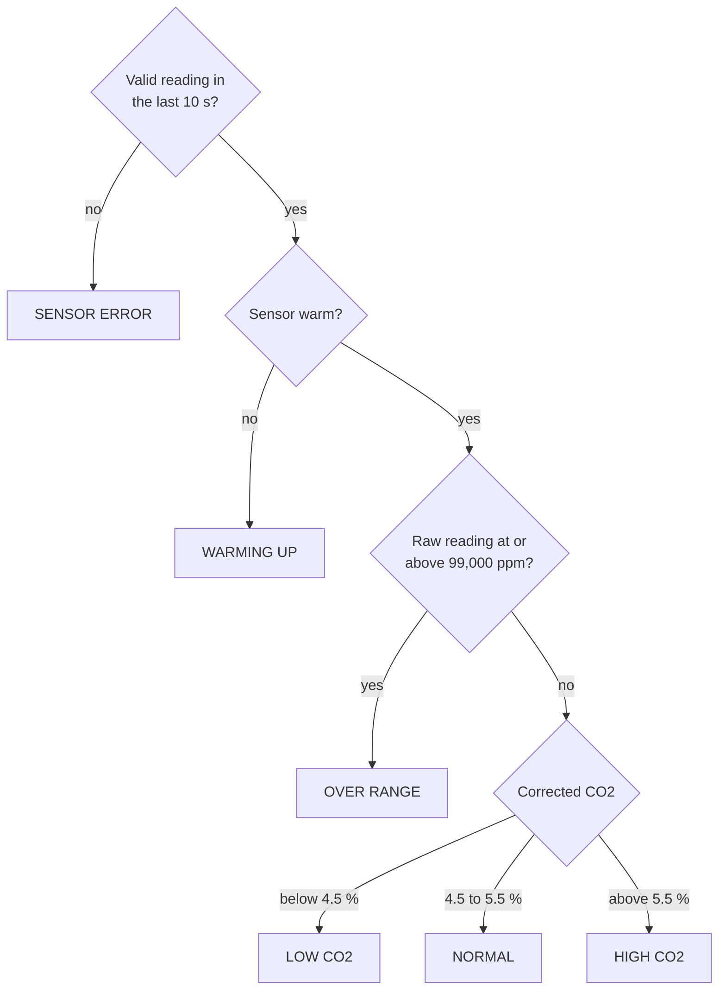
```mermaid
flowchart TD
  A{"Valid reading in<br/>the last 10 s?"}
  A -- no --> E["SENSOR ERROR"]
  A -- yes --> D{"Sensor warm?"}
  D -- no --> W["WARMING UP"]
  D -- yes --> O{"Raw reading at or<br/>above 99,000 ppm?"}
  O -- yes --> OR["OVER RANGE"]
  O -- no --> F{"Corrected CO2"}
  F -- "below 4.5 %" --> L["LOW CO2"]
  F -- "4.5 to 5.5 %" --> N["NORMAL"]
  F -- "above 5.5 %" --> H["HIGH CO2"]
```

## An hour in the incubator

A log from the monitor itself: 384 readings, ten seconds apart. The data is in [data/incubator-hour.csv](data/incubator-hour.csv).

| Noise at rest | Fastest fall | Back in band | Below the band |
|---|---|---|---|
| ±17 ppm | 2.7 % per min | 4.7 min | 26 of 64 min |

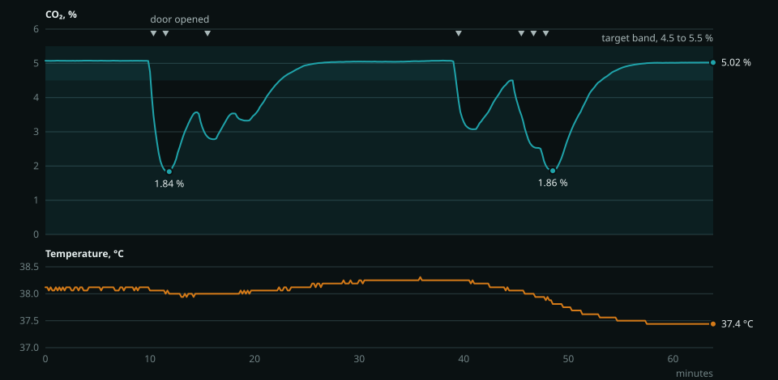

- The door was opened in two bursts. Each time CO₂ fell from 5.1 % to about 1.8 %.
- After the last opening the incubator brought CO₂ back into the band in 4.7 minutes and settled in 7.7.
- Temperature stayed between 37.4 and 38.3 °C throughout.

### Recovery after the door closes

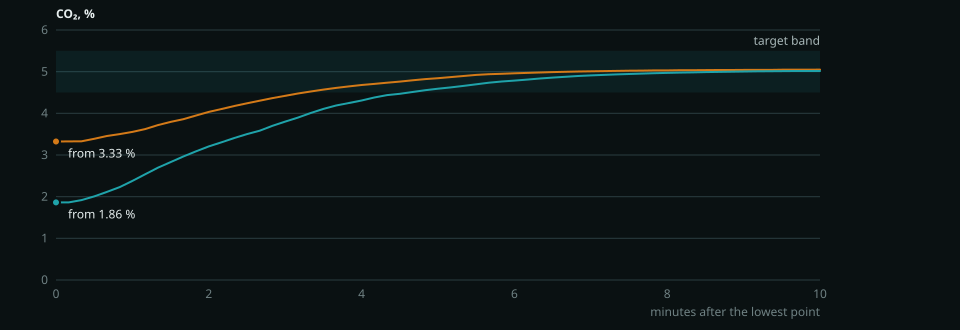

Orange is the recovery from the shallower drop, teal from the deeper one.

## Ten days in the incubator

One unbroken log from the SD card: 91,739 readings, summarised by the hour in [data/long-run-hourly.csv](data/long-run-hourly.csv).

| Running without a restart | Time inside the band | Left the band | Time above the band |
|---|---|---|---|
| 10.6 days | 97 % | 50 times | none |

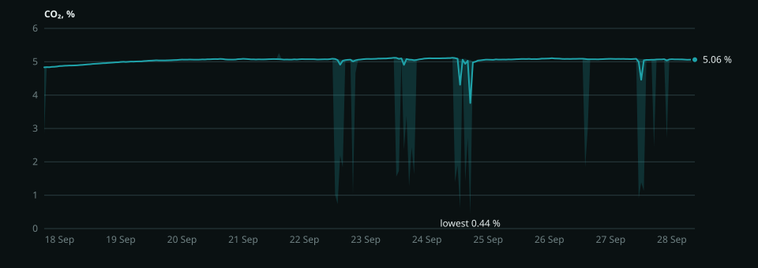

- The resting reading climbed from 4.84 % to 5.08 % over the first three days, then held.
- Every excursion was a dip, never a rise.
- The deepest dip reached 0.44 %.

### The sensor needs three days to settle

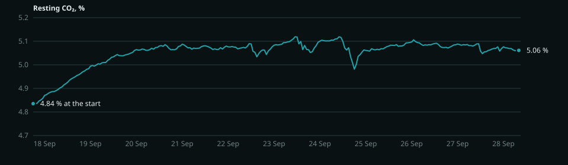

## Web dashboard

Open the Connect page on the monitor and scan its QR codes with a phone. One joins the monitor's own network and the other opens the page. The page shows the live reading and the history, sets the monitor's clock from the phone, and offers every log file on the SD card for download.

The monitor starts a new numbered log file at each power-on, such as co2_0007.csv, with one row every ten seconds.

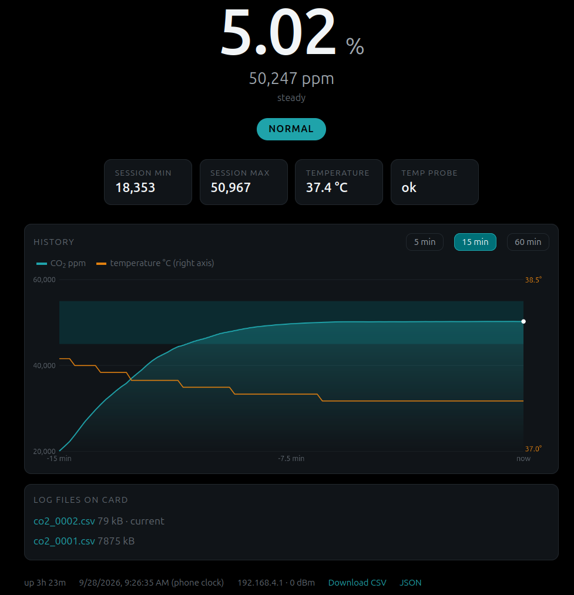

## Calibrate before trusting it

1. Let the monitor run in an incubator at a known setpoint for three days. The reading climbs while the sensor settles.
2. Read the raw value in brackets on the main page.
3. Divide the known value by the raw value. For 5.0 % known and 6.7 % raw that is 0.75.
4. Set CO2_CAL_GAIN to that number in Config.h and flash again.

The firmware ships uncorrected, with a gain of 1.0. The unit in these photos needed 0.72. Repeat the check from time to time.

## Checks and faults

| Diagnostics row | Healthy | If not |
|---|---|---|
| `PWM period` | about 1001 ms | Not an MH-Z16 signal |
| `edges/s` | 2.0 | Near 0: PWM wire is off |
| `valid/rej` | rejected stays at 0 | Loose PWM or GND wire |
| `DS18B20` | ok 12-bit | Probe not found at power-on |

**Shows about 5 % at power-on.** Normal. The sensor reports 50,000 ppm while it preheats.

**Temperature shows n/a.** Check the adapter's screw terminals, then power-cycle.

**Taps land in the wrong place.** Run the touch calibration again.

**Cannot join the lab network.** After 60 seconds it starts its own network, CO2-monitor. Join it and open http://192.168.4.1/.

---
Generated by `tools/make_build_guide.py`. Edit that script, not this file.
